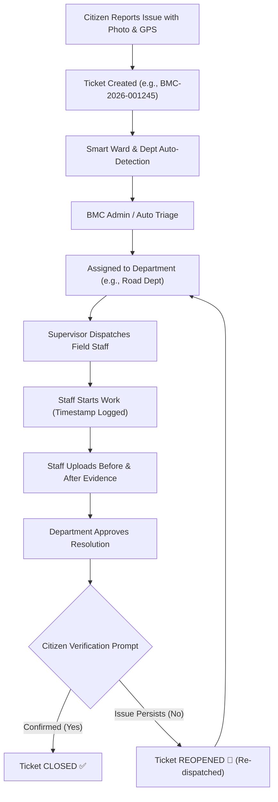

# 🏛️ BMC CivicConnect — Smart Civic Complaint & Service Management Platform

<p align="center">
  <b>Report. Assign. Resolve. Verify.</b><br>
  <i>A modern, full-stack civic governance and service delivery platform connecting Citizens, Municipal Administration, Departments, and Field Workers in a verifiable closed-loop ecosystem.</i>
</p>

<p align="center">
  
  
  
  
  
  
</p>

---

## 📑 Table of Contents
- [1. Overview & Vision](#1-overview--vision)
- [2. The 4 Dedicated Panels](#2-the-4-dedicated-panels)
- [3. End-to-End Complaint Lifecycle](#3-end-to-end-complaint-lifecycle)
- [4. Smart Platform Features](#4-smart-platform-features)
- [5. Technology Stack](#5-technology-stack)
- [6. System Architecture](#6-system-architecture)
- [7. Database Schema & Data Models](#7-database-schema--data-models)
- [8. API Specification & Realtime Events](#8-api-specification--realtime-events)
- [9. Directory Structure](#9-directory-structure)
- [10. Quick Start & Setup Guide](#10-quick-start--setup-guide)
- [11. MVP Demo Walkthrough](#11-mvp-demo-walkthrough)
- [12. Standards & Guidelines](#12-standards--guidelines)

---

## 1. Overview & Vision

**BMC CivicConnect** transitions traditional, fragmented municipal complaint systems into an automated, transparent, and accountable digital operations platform.

### Core Value Proposition
> **Every civic issue has a ticket, every ticket has an owner, every action is tracked, every resolution has photographic proof, and every citizen has the final say before ticket closure.**

---

## 2. The 4 Dedicated Panels

| Panel | Target Audience | Primary Focus | Key Capabilities |
| :--- | :--- | :--- | :--- |
| **📱 Citizen Portal** | City Residents | Intuitive issue reporting & tracking | • OTP Authentication<br>• GPS & Map-based pin drop<br>• Real-time ticket status timeline<br>• **Before & After resolution comparison**<br>• One-click resolution verification or reopen |
| **🖥️ BMC Admin Command Center** | Municipal Commissioners & City Admins | City-wide oversight & governance | • High-level KPI Dashboard<br>• **Interactive GIS Live Map** with Ward boundaries<br>• Smart Department routing & triage<br>• Multi-level SLA breach escalation center<br>• Master Data management (Wards, Zones, Staff) |
| **🏢 Department Portal** | Department Heads & Supervisors | Queue management & staff dispatching | • Department-specific triage queue<br>• Field staff workload balancer & assignment<br>• Resolution quality review before citizen dispatch<br>• Real-time SLA countdown timers |
| **👷 Field Staff Mobile App** | On-Ground Field Workers | Mobile-first execution & proof submission | • Prioritized daily task queue<br>• One-touch GPS navigation to complaint site<br>• Timestamped "Start Work" trigger<br>• **Mandatory Before & After photo uploads** with work notes |

---

## 3. End-to-End Complaint Lifecycle



### Complete Status State Machine
- `SUBMITTED` $\rightarrow$ Initial citizen submission.
- `UNDER_REVIEW` $\rightarrow$ Pending admin review.
- `ASSIGNED` $\rightarrow$ Allocated to specific department and field staff.
- `IN_PROGRESS` $\rightarrow$ Field worker on-site, work underway.
- `RESOLVED` / `AWAITING_VERIFICATION` $\rightarrow$ Proof submitted, awaiting citizen feedback.
- `CLOSED` $\rightarrow$ Verified and closed.
- `REOPENED` $\rightarrow$ Citizen reported dissatisfaction; sent back to queue.
- `REJECTED` $\rightarrow$ Invalid or out-of-jurisdiction request (with justification).

---

## 4. Smart Platform Features

1. **Smart Ward Detection**: Automatically computes municipal ward number from geolocation coordinates using GeoJSON polygon containment (`$geoIntersects`).
2. **Smart Department Routing**: Automatically classifies issue categories (e.g., *Potholes* $\rightarrow$ *Roads*, *Overflowing Bins* $\rightarrow$ *Sanitation*, *Dark Streets* $\rightarrow$ *Electrical*).
3. **500-Meter Duplicate Detection**: Flags nearby existing tickets in real-time to prevent redundant work orders and duplicate technician dispatches.
4. **Hierarchical SLA Escalation**:
   - **Emergency**: $\le 4\text{ Hours}$
   - **High**: $\le 24\text{ Hours}$
   - **Normal**: $\le 72\text{ Hours}$
   - Automated alerts escalate: $\text{Field Worker} \rightarrow \text{Supervisor} \rightarrow \text{Dept Head} \rightarrow \text{Admin Command Center}$.

---

## 5. Technology Stack

### Backend
- **Runtime**: Node.js v20+ with TypeScript
- **Framework**: Express.js (Modular MVC / Service-Repository Pattern)
- **Database**: MongoDB v7+ (Mongoose ODM, `2dsphere` Geospatial Indexes)
- **Realtime**: Socket.io (Room-based event streams)
- **Validation**: Zod (Strict schema validation)
- **Auth**: JWT (Access Token + HttpOnly Refresh Cookie) + Role-Based Access Control (RBAC)
- **Storage**: Cloudinary / AWS S3 for photographic proof

### Frontend
- **Framework**: React 18+ (Vite) / Next.js with TypeScript
- **Styling**: TailwindCSS + Shadcn/UI (Radix UI Primitives)
- **State Management**: TanStack Query (React Query v5) + Zustand
- **GIS & Maps**: Leaflet / React-Leaflet with OpenStreetMap layers
- **Icons**: Lucide React

---

## 6. System Architecture

```mermaid
flowchart LR
    subgraph Frontend["Frontend Clients"]
        CP[Citizen PWA]
        Admin[Admin Command Center]
        Dept[Dept Portal]
        Field[Field Staff App]
    end

    subgraph Backend["API & Realtime Gateway"]
        API[Express REST API]
        Sockets[Socket.io Realtime Hub]
        Auth[Auth & RBAC Middleware]
    end

    subgraph Services["Core Engine"]
        TService[Ticket State Service]
        GService[GIS & Ward Engine]
        SService[SLA & Escalation Engine]
        EService[Evidence Service]
    end

    subgraph Data["Persistence Layer"]
        DB[(MongoDB Database)]
        Cache[(Redis Cache / Queues)]
        Files[(Cloud Media Storage)]
    end

    Frontend <--> Backend
    Backend <--> Services
    Services <--> Data
```



---

## 7. Database Schema & Data Models

Refer to the [Master Architecture Specification](docs/MASTER_SYSTEM_ARCHITECTURE.md) for full Mongoose schema definitions:
- **`Users`**: Citizens, Admins, Officers, and Field Staff with RBAC.
- **`Complaints`**: Core ticket schema with GeoJSON coordinates, SLA targets, status timeline, and evidence links.
- **`Departments` & `Employees`**: Municipal department catalog and personnel availability.
- **`Zones` & `Wards`**: Geographic spatial polygon boundaries.
- **`AuditLogs`**: Append-only log of every system action and status change.
- **`Notifications` & `Announcements`**: Multi-channel alerts.

---

## 8. API Specification & Realtime Events

### Core REST Endpoints
| Method | Endpoint | Access | Purpose |
| :--- | :--- | :--- | :--- |
| `POST` | `/api/v1/auth/otp/send` | Public | Send OTP for mobile login/registration |
| `POST` | `/api/v1/auth/otp/verify` | Public | Verify OTP and issue JWT tokens |
| `POST` | `/api/v1/complaints` | Citizen / Admin | Create a new civic complaint with location & photos |
| `GET` | `/api/v1/complaints/my` | Citizen | Get all tickets created by the authenticated citizen |
| `GET` | `/api/v1/complaints` | Admin / Dept | Get filtered complaints list (by Ward, Dept, Status, SLA) |
| `GET` | `/api/v1/complaints/:id` | Authenticated | Get complete ticket details, timeline, and proof |
| `PATCH`| `/api/v1/complaints/:id/assign`| Admin / Dept | Assign department or field staff |
| `PATCH`| `/api/v1/complaints/:id/start-work`| Field Staff | Timestamp work commencement |
| `PATCH`| `/api/v1/complaints/:id/resolve`| Field Staff / Dept | Submit Before/After photos and resolution note |
| `PATCH`| `/api/v1/complaints/:id/verify`| Citizen | Verify resolution (`YES` $\rightarrow$ Closed, `NO` $\rightarrow$ Reopen) |
| `GET` | `/api/v1/geo/detect-ward` | Authenticated | Reverse lookup ward polygon from coordinates |
| `GET` | `/api/v1/analytics/overview` | Admin | Aggregate city KPIs, category counts, and resolution rates |

---

## 9. Directory Structure

```
Tech-Practical/
├── docs/                                 # Architectural blueprints & PRDs
│   ├── MASTER_SYSTEM_ARCHITECTURE.md     # Master System Architecture & Schemas
│   ├── BMC Admin Panel — MVP.md          # Admin Panel Specification
│   ├── Citizen Panel — MVP.md            # Citizen Portal Specification
│   ├── Department Panel — MVP.md         # Department Portal Specification
│   ├── Field Staff Panel — MVP.md        # Field Staff App Specification
│   └── Smart Civic Complaint & ... .md  # Master Platform PRD
├── .agents/                              # AI Assistant & Engineering Rules
│   └── rules/
│       ├── mern-standards.md             # Coding conventions for MERN & TypeScript
│       ├── database-rules.md             # MongoDB & Geospatial indexing rules
│       ├── ui-ux-design-rules.md         # Design system & color tokens
│       └── workflow-and-state-machine.md # State transition & SLA rules
├── GEMINI.md                             # AI Development Guidelines
├── AGENTS.md                             # Agent Orchestration Reference
└── README.md                             # Main documentation (this file)
```

---

## 10. Quick Start & Setup Guide

### Prerequisites
- **Node.js**: v20.x or later
- **MongoDB**: v7.0+ (Local instance or MongoDB Atlas)
- **Package Manager**: `npm` or `pnpm`

### Environment Configuration (`.env.example`)
Create a `.env` file in the `server/` directory:
```env
PORT=5000
NODE_ENV=development
CLIENT_URL=http://localhost:5173

# Database
MONGODB_URI=mongodb://localhost:27017/bmc_civic_connect

# Authentication
JWT_ACCESS_SECRET=super_secret_jwt_access_key_12345
JWT_REFRESH_SECRET=super_secret_jwt_refresh_key_67890
JWT_ACCESS_EXPIRES_IN=15m
JWT_REFRESH_EXPIRES_IN=7d

# Cloud Storage (Cloudinary)
CLOUDINARY_CLOUD_NAME=your_cloud_name
CLOUDINARY_API_KEY=your_api_key
CLOUDINARY_API_SECRET=your_api_secret
```

---

## 11. MVP Demo Walkthrough

To experience the complete closed-loop lifecycle during a live presentation:

1. **Citizen Submission**:
   - Citizen logs in, selects **"Road & Pothole"**, uploads a photo, drops pin in Ward 5.
   - System registers ticket `BMC-2026-001245` with High Priority.
2. **Admin Command Center**:
   - Admin views real-time ticket arrival on the **GIS Map**.
   - Admin accepts smart recommendation: Assign to **Road & Infrastructure Department**.
3. **Department Dispatch**:
   - Road Department Officer opens ticket and assigns field staff **Amit Patel**.
4. **Field Execution**:
   - Amit receives notification on mobile, clicks **"Navigate"**, arrives on-site.
   - Amit clicks **"Start Work"**, uploads **Before Photo**, fixes pothole, uploads **After Photo**, and submits.
5. **Citizen Closed-Loop Verification**:
   - Citizen receives instant push notification: *"Your complaint has been resolved. Please verify."*
   - Citizen inspects Before vs After photos and taps **"Yes, Issue Resolved"**.
   - Status updates in realtime to **`CLOSED`** across all dashboards.

---

## 12. Standards & Guidelines

- **Architecture Blueprint**: [MASTER_SYSTEM_ARCHITECTURE.md](docs/MASTER_SYSTEM_ARCHITECTURE.md)
- **MERN Code Standards**: [.agents/rules/mern-standards.md](.agents/rules/mern-standards.md)
- **Database & Geospatial Guidelines**: [.agents/rules/database-rules.md](.agents/rules/database-rules.md)
- **Design System Tokens**: [.agents/rules/ui-ux-design-rules.md](.agents/rules/ui-ux-design-rules.md)
- **State Machine Guardrails**: [.agents/rules/workflow-and-state-machine.md](.agents/rules/workflow-and-state-machine.md)

---

<p align="center">
  <b>BMC CivicConnect — Transforming Municipal Governance Through Transparent Technology.</b>
</p>
