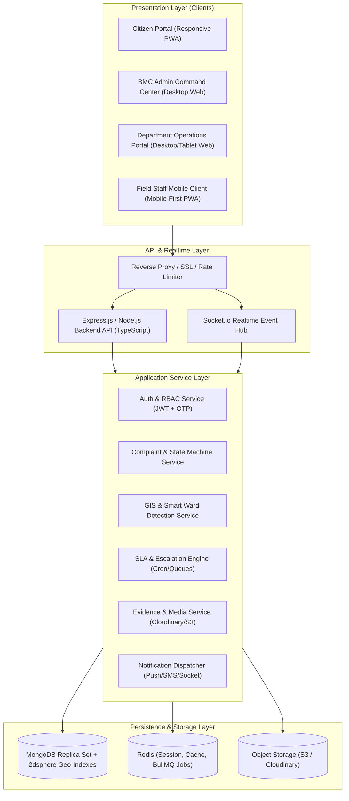
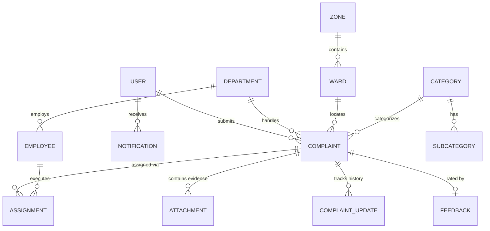

# BMC CivicConnect — Master System Architecture & Engineering Specification

> **Platform Tagline:** *Report. Assign. Resolve. Verify.*  
> **Target Architecture:** Modern MERN (MongoDB, Express.js, React 18+ / Vite, Node.js) with TypeScript, Leaflet/Mapbox GIS, Socket.io, and Cloudinary/S3 Storage.

---

## 1. Executive Architecture Overview

BMC CivicConnect is a high-availability, multi-tenant civic issue tracking and governance platform designed for municipal corporations. It bridges citizens with municipal administration through transparent workflows, geographic mapping, and photographic proof of work.



---

## 2. Role-Based Access Control (RBAC) Matrix

| Feature / Entity | Citizen | Field Staff | Department Officer / Supervisor | BMC Central Admin |
| :--- | :---: | :---: | :---: | :---: |
| **Register / OTP Login** | ✅ | ❌ (Pre-created) | ❌ (Pre-created) | ❌ (Superadmin seeded) |
| **Create Complaint** | ✅ | ❌ | ❌ | ✅ (On behalf of citizen) |
| **View Own Complaints** | ✅ | ❌ | ❌ | ❌ |
| **View Assigned Tasks** | ❌ | ✅ (Assigned only) | ❌ | ❌ |
| **View Department Queue** | ❌ | ❌ | ✅ (Dept scoped) | ❌ |
| **View All City Complaints**| ❌ | ❌ | ❌ | ✅ (City-wide) |
| **Smart Routing / Triage** | ❌ | ❌ | ❌ | ✅ |
| **Assign Field Staff** | ❌ | ❌ | ✅ | ✅ |
| **Start Work (Timestamp)** | ❌ | ✅ | ❌ | ❌ |
| **Upload Before/After Proof** | ❌ | ✅ | ❌ | ❌ |
| **Review Resolution Proof** | ❌ | ❌ | ✅ | ✅ |
| **Verify Resolution (Yes/No)**| ✅ | ❌ | ❌ | ❌ |
| **Reopen Ticket** | ✅ | ❌ | ❌ | ✅ |
| **Manage Wards & Zones** | ❌ | ❌ | ❌ | ✅ |
| **Manage Employees** | ❌ | ❌ | ✅ (View Dept staff) | ✅ (Full CRUD) |
| **Broadcast Announcements** | ❌ | ❌ | ❌ | ✅ |
| **City Analytics & Audit Logs**| ❌ | ❌ | ✅ (Dept Level) | ✅ (City Level) |

---

## 3. Database Schema & Data Models (MongoDB / Mongoose)

### 3.1 ER Diagram Concept



### 3.2 Detailed Mongoose Schemas

#### 1. User & Employee Schema (`users.ts`)
```typescript
interface IUser {
  _id: ObjectId;
  name: string;
  mobile: string; // Unique, Indexed
  email?: string;
  role: 'CITIZEN' | 'FIELD_STAFF' | 'DEPT_OFFICER' | 'DEPT_SUPERVISOR' | 'BMC_ADMIN';
  departmentId?: ObjectId; // Ref: Department
  zoneId?: ObjectId;       // Ref: Zone
  wardId?: ObjectId;       // Ref: Ward
  employeeId?: string;     // Unique for staff
  avatarUrl?: string;
  isActive: boolean;
  fcmToken?: string;       // Push notifications
  createdAt: Date;
  updatedAt: Date;
}
```

#### 2. Zone & Ward Schema (`wards.ts`)
```typescript
interface IZone {
  _id: ObjectId;
  name: string; // e.g. "East Zone", "West Zone"
  code: string;
}

interface IWard {
  _id: ObjectId;
  zoneId: ObjectId;
  wardNumber: number; // e.g. 5
  name: string;       // e.g. "Kaliabid Ward"
  boundaryPolygon: {
    type: 'Polygon';
    coordinates: number[][][]; // GeoJSON format for spatial queries
  };
  officeAddress?: string;
  nodalOfficerId?: ObjectId;
}
```

#### 3. Category & Department Schema (`departments.ts` & `categories.ts`)
```typescript
interface IDepartment {
  _id: ObjectId;
  name: string; // e.g. "Road & Infrastructure", "Sanitation", "Water Supply"
  code: string; // e.g. "DEPT_ROAD"
  description: string;
  headOfficerId?: ObjectId;
  defaultSlaHours: {
    EMERGENCY: number; // e.g. 4 hours
    HIGH: number;      // e.g. 24 hours
    NORMAL: number;    // e.g. 72 hours
  };
  isActive: boolean;
}

interface ICategory {
  _id: ObjectId;
  name: string; // e.g. "Road & Pothole"
  icon: string;
  defaultDepartmentId: ObjectId; // Auto-suggestion link
  defaultPriority: 'NORMAL' | 'HIGH' | 'EMERGENCY';
  subcategories: string[]; // e.g. ["Pothole Repair", "Road Cave-in", "Footpath Damaged"]
  isActive: boolean;
}
```

#### 4. Complaint Schema (`complaints.ts`)
```typescript
interface IComplaint {
  _id: ObjectId;
  ticketId: string; // e.g. "BMC-2026-001245" (Indexed, Unique)
  citizenId: ObjectId; // Ref: User
  categoryId: ObjectId; // Ref: Category
  subcategory?: string;
  title: string;
  description: string;
  
  // Geospatial Information
  location: {
    type: 'Point';
    coordinates: [number, number]; // [Longitude, Latitude] - 2dsphere Indexed
    address: string;
    landmark?: string;
  };
  zoneId: ObjectId;
  wardId: ObjectId;

  // Workflow & Assignment
  status: 
    | 'SUBMITTED'
    | 'UNDER_REVIEW'
    | 'ASSIGNED'
    | 'IN_PROGRESS'
    | 'RESOLVED'
    | 'AWAITING_VERIFICATION'
    | 'CLOSED'
    | 'REOPENED'
    | 'REJECTED';
    
  priority: 'NORMAL' | 'HIGH' | 'EMERGENCY';
  assignedDepartmentId?: ObjectId;
  assignedSupervisorId?: ObjectId;
  assignedFieldStaffId?: ObjectId;

  // SLA & Timeline
  slaTargetHours: number;
  slaDeadline: Date; // Calculated at assignment
  slaBreached: boolean;
  workStartedAt?: Date;
  workCompletedAt?: Date;
  resolvedAt?: Date;
  closedAt?: Date;

  // Proof & Evidence Attachments
  citizenAttachments: Array<{
    url: string;
    fileType: 'IMAGE' | 'VIDEO';
    uploadedAt: Date;
  }>;
  resolutionEvidence?: {
    beforePhotoUrl: string;
    afterPhotoUrl: string;
    resolutionNote: string;
    submittedBy: ObjectId;
    submittedAt: Date;
  };

  // Reopen Details
  reopenHistory?: Array<{
    reopenedAt: Date;
    reason: string;
    photoUrl?: string;
  }>;

  isDuplicate: boolean;
  parentComplaintId?: ObjectId; // If marked duplicate of another ticket

  createdAt: Date;
  updatedAt: Date;
}
```

#### 5. Complaint Audit Log Schema (`auditLogs.ts`)
```typescript
interface IAuditLog {
  _id: ObjectId;
  complaintId: ObjectId;
  actorId: ObjectId;
  actorRole: string;
  action: string; // e.g. "STATUS_CHANGE", "ASSIGNED_STAFF", "SLA_BREACH_TRIGGERED"
  fromState?: string;
  toState?: string;
  comment?: string;
  metadata?: Record<string, any>;
  timestamp: Date;
}
```

---

## 4. State Machine Transition Table

To ensure zero invalid status jumps, the backend service must enforce this transition matrix:

| Current Status | Allowed Next Status | Triggered By | Mandatory Payload / Condition |
| :--- | :--- | :--- | :--- |
| `SUBMITTED` | `UNDER_REVIEW`, `ASSIGNED`, `REJECTED` | System / BMC Admin | Dept selection or Rejection reason |
| `UNDER_REVIEW` | `ASSIGNED`, `REJECTED` | BMC Admin | Dept selection |
| `ASSIGNED` | `IN_PROGRESS`, `ASSIGNED` (Reassign) | Supervisor / Field Staff | Field staff ID attached |
| `IN_PROGRESS` | `AWAITING_VERIFICATION`, `RESOLVED` | Field Staff / Supervisor | `beforePhotoUrl`, `afterPhotoUrl`, `resolutionNote` |
| `AWAITING_VERIFICATION` | `CLOSED` | Citizen | Rating & feedback (Optional) |
| `AWAITING_VERIFICATION` | `REOPENED` | Citizen | Reopening reason & optional photo |
| `REOPENED` | `ASSIGNED`, `IN_PROGRESS` | Dept Supervisor / Admin | Re-dispatch field worker |
| `CLOSED` | `REOPENED` (Within 48h limit) | Citizen | Justification note |
| `REJECTED` | — (Terminal) | Admin | Documented reason |

---

## 5. Smart Algorithms & Engines

### 5.1 Smart Ward Detection
Using MongoDB `$geoIntersects` with GeoJSON Polygon boundaries:
```typescript
async function detectWard(longitude: number, latitude: number): Promise<IWard | null> {
  return await WardModel.findOne({
    boundaryPolygon: {
      $geoIntersects: {
        $geometry: {
          type: "Point",
          coordinates: [longitude, latitude]
        }
      }
    }
  });
}
```

### 5.2 500-Meter Duplicate Detection Engine
Using MongoDB `$nearSphere` or `$geoWithin`:
```typescript
async function findNearbyDuplicates(
  categoryId: ObjectId,
  coordinates: [number, number],
  radiusMeters: number = 500
): Promise<IComplaint[]> {
  return await ComplaintModel.find({
    categoryId,
    status: { $in: ['SUBMITTED', 'UNDER_REVIEW', 'ASSIGNED', 'IN_PROGRESS'] },
    'location.coordinates': {
      $nearSphere: {
        $geometry: {
          type: 'Point',
          coordinates: coordinates
        },
        $maxDistance: radiusMeters
      }
    }
  }).limit(10);
}
```

### 5.3 SLA Calculation & Escalation Engine (BullMQ / Node Cron)
Runs periodically every 5 minutes:
1. Queries all non-closed complaints where `slaDeadline <= new Date()` and `slaBreached: false`.
2. Marks `slaBreached: true`.
3. Dispatches escalating notifications:
   - **Level 1 Breach (0-2h)**: Notification to Supervisor & Field Staff.
   - **Level 2 Breach (2-6h)**: Escalation to Department Head.
   - **Level 3 Breach (>6h)**: Escalation alert directly onto BMC Admin Dashboard.

---

## 6. Realtime Communication Protocol (Socket.io Events)

| Event Name | Direction | Payload | Purpose |
| :--- | :--- | :--- | :--- |
| `join:room` | Client $\rightarrow$ Server | `{ roomId: string }` | Join specific ticket room or user private room |
| `ticket:new` | Server $\rightarrow$ Admin/Dept | `IComplaint` | Instant UI update when ticket is logged |
| `ticket:status_changed` | Server $\rightarrow$ All Stakeholders | `{ ticketId, status, updatedBy, timestamp }` | Realtime status timeline shift |
| `ticket:assigned` | Server $\rightarrow$ Field Staff | `{ ticketId, taskDetails, deadline }` | Push notification / alert to mobile app |
| `ticket:sla_warning` | Server $\rightarrow$ Dept/Admin | `{ ticketId, hoursRemaining }` | Visual flashing badge on dashboard |
| `announcement:broadcast`| Server $\rightarrow$ Citizen Portal | `{ title, message, affectedWards }` | Top banner notification |

---

## 7. Security, Privacy & Integrity Standards

1. **Strict Geolocation & Timestamp Watermarking**:
   - Field staff resolution photos are tagged with EXIF metadata (GPS + Time) and hashed on upload to prevent fake or stock image submissions.
2. **Citizen Data Privacy**:
   - Citizen phone numbers and personal emails are masked for Department Officers and Field Staff (e.g. `+91 98765*****`), visible only to BMC Super Admins for harassment prevention.
3. **Stateless JWT Auth with Refresh Tokens**:
   - Short-lived Access Tokens (15 mins) + Secure HttpOnly Refresh Tokens (7 days).
4. **Input Sanitization & Schema Validation**:
   - Every endpoint validated via **Zod** schema validation. No unvalidated parameters hit the database layer.
